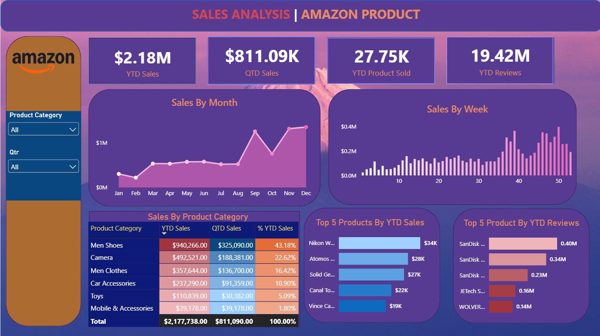

# 📊 Amazon Product Sales Analysis Dashboard

An interactive **Amazon Product Sales Analysis Dashboard** developed using **Microsoft Power BI** to analyze sales performance, product categories, customer reviews, and sales trends.

The project transforms raw Amazon product data into meaningful business insights through interactive visualizations, KPIs, and filters.

---

## 🎯 Project Objective

The main objective of this project is to analyze Amazon product sales data and build an interactive dashboard that helps users:

- Monitor overall sales performance
- Analyze monthly and weekly sales trends
- Compare product categories
- Identify top-performing products
- Analyze customer review performance
- Understand category-wise contribution to sales
- Interactively explore the data using filters

---

## 📌 Dashboard Overview

The dashboard provides a comprehensive view of Amazon product performance through key performance indicators and interactive charts.

### 🔑 Key Performance Indicators

| Metric | Value |
|---|---:|
| 💰 YTD Sales | **$2.18M** |
| 💵 QTD Sales | **$811.09K** |
| 📦 YTD Products Sold | **27.75K** |
| ⭐ YTD Reviews | **19.42M** |

---

## 📈 Dashboard Features

### 1. Sales Trend Analysis

- Monthly sales analysis
- Weekly sales analysis
- Year-to-Date (YTD) sales
- Quarter-to-Date (QTD) sales
- Identification of sales growth patterns

### 2. Product Category Analysis

The dashboard compares sales performance across different categories, including:

- Men Shoes
- Camera
- Men Clothes
- Car Accessories
- Toys
- Mobile & Accessories

It also provides:

- YTD Sales
- QTD Sales
- Percentage contribution to total sales

### 3. Top Product Analysis

The dashboard identifies the:

- **Top 5 products by YTD Sales**
- **Top 5 products by YTD Reviews**

This helps highlight products with strong sales performance and customer engagement.

### 4. Interactive Filters

Users can dynamically explore the dashboard using:

- Product Category
- Quarter

---

## 🛠️ Tools & Technologies

- **Microsoft Power BI**
- **Power Query**
- **DAX**
- **Data Cleaning**
- **Data Transformation**
- **Data Modeling**
- **Data Visualization**
- **Business Intelligence**

---

## 🔍 Key Insights

Some of the insights obtained from the dashboard include:

- **Men Shoes** is the highest-performing category by YTD sales.
- **Camera** is the second-largest contributor to YTD sales.
- Sales increase significantly during the later months of the year.
- A relatively small number of products contribute substantially to overall sales.
- Customer review volumes vary considerably across products.
- Category-level analysis helps identify the major contributors to total sales.

---

## 🖼️ Dashboard Preview



---

## 📂 Repository Structure

```text
amazon-product-sales-analysis-powerbi/
│
├── README.md
│
├── Amazon Product Analysis.pbix
│
└── screenshots/
    └── amazon-sales-dashboard.png
